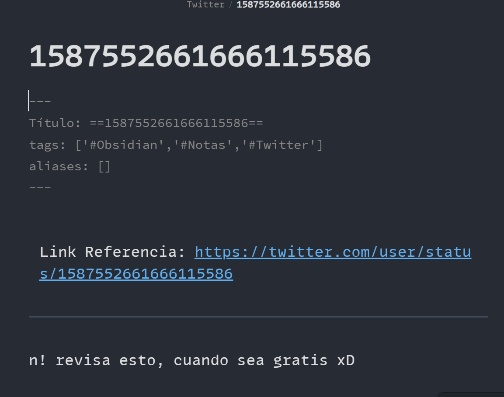

# **Obsidian Notes con Twitter**

## Descripción

Obsidian es un gestor de conocimiento usado para construir un cerebro digital. 
Twitter es una red social donde se comparte variada e interesante información de toda índole en un formato corto de 280 caracteres por post.

Este proyecto busca crear notas cortas a partir de re tuits con un comando y hacerlas disponibles en el cerebro digital automáticamente. Estas entradas rápidas se pueden crear desde la app de twitter del celular y ser analizadas en el ordenador directamente con [[Obsidian]].

## ¿Cómo funciona?

Es un bot que constantemente monitorea en Twitter buscando re tuits del mi usuario @jpcr3spo que empiezan con el texto '!n'. Este comando le indica que tuits se quieren convertir en notas.

Contiene las siguientes partes:
- Usar el API de Twitter para automatizar búsquedas.
- Crear archivos y subirlos a un repositorio con Git. Obsidian tiene un plugin 'Obsidian-git' que sincroniza el repositorio en los dispositivos donde este el cerebro digital automáticamente.
- Usar un Raspberry para correr el bot que crea notas. 

## Instalación

Para desplegar el proyecto se necesitan algunos pre requisitos:

	- Tokens de acceso al API de Twitter.
	 Esta se almacena en variables de entorno.
	- Raspberry Pi4 con un sistema Raspbian
	 previamente configurado.

Al clonar el repositorio, el archivo `req.txt` contiene todos los paquetes que necesitamos en [[Python]]. Usamos [[pip]] para instalarlos en un entorno virtual.

``` sh %lenguaje
python -m venv rpibots && cd rpibots
source bin/activate
git clone
cd obsidian-notes/
pip install -r req.txt
```

Luego de correr el script `notas.py` se crean las notas en Markdown en la dirección del cerebro digital (declarado explicitamente en el mismo script).

### Automatizando con Crontab

Se debe dar permisos para ejecutar el archivo `obs_git.sh` y `notas.py`, para sincronizar el repositorio con las notas creadas. 

``` sh
chmod +x notas.py obs_git.sh
chown admin: notas.py obs_git.sh
```

Para automatizar los scripts configuramos el archivo `crontab` para que se creen notas buscando nuevos re tuits con el comando 'n!' cada 15 min y que sincronice el cerebro en Obsidian.
``` config
# Crontab
*/15 * * * * python -B script.py
*/16 * * * * ./script.sh
```

El script `notas.py` se encarga de buscar los últimos tuits con '!n' y de crear la nota en formato markdown.


El script `obs_git.sh` se encarga de subir y sincronizar el cerebro digital de Obsidian con la última nota creada.

Finalmente en un ordenador teniendo Obsidian y el plugin git la sincronización es automática nada más ejecutarlo.




## Conclusiones.

Esta forma de montar un bot en un Raspberry Pi (usando crontab) es bastante rápida. El problema es acceder a los Tokens de acceso a Twitter desde la plataforma de desarrolladores.

Se probó en otra máquina Linux con Debian y funcionó de igual manera. 


